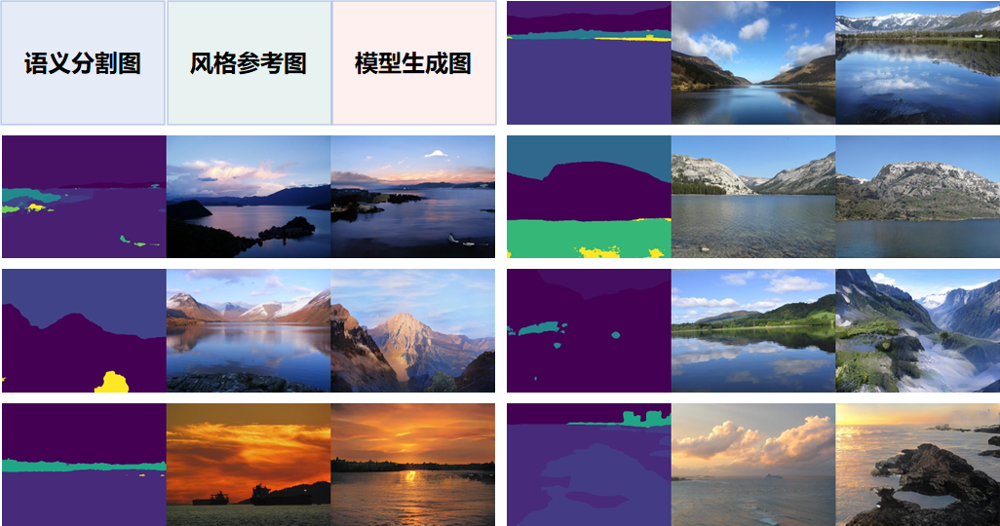

# 第三届计图人工智能挑战赛-赛道一

[]() [](https://www.educoder.net/competitions/Jittor-4)


## 简介

本项目为第三届计图挑战赛赛道一（风格及语义引导的风景图片生成）的代码实现。

赛题提供1000张测试分割图片作为语义图，每张语义图会对应一张训练集中的图作为参考图，对应关系用一个`json`文件给定。最终模型实现：根据输入的语义和参考图，输出生成图。生成图需要考虑语义图的语义分割信息，以及参考图的（色调等）风格信息。


## 安装 

#### 运行环境

- ubuntu 20.04 LTS
- python 3.8.16
- jittor 1.3.8

#### 安装依赖

执行以下命令安装 python 依赖

```bash
pip install -r requirements.txt
```

#### 预训练模型

预训练模型模型[下载地址](https://pan.baidu.com/s/1fkJeuWiQRpiRm36tkcC1gg?pwd=8n9c)，下载后放入目录 `<root>/checkpoints/` 下，最终`checkpoints`目录结构为：

```
checkpoints/
|–– fusion/
|   |–– 360_net_E.pkl
|   |–– 360_net_G.pkl
|–– merge/
|   |–– avg_237_272_net_E.pkl
|   |–– avg_237_272_net_G.pkl
|–– train_fid_m.npy
|–– train_fid_s.npy
```


## 数据集下载

清华大学计算机系图形学实验室从Flickr官网收集了12000张高清（宽512、高384）的风景图片，并制作了它们的语义分割图。其中，10000对图片被用来训练。

训练数据集可以从[这里](https://pan.baidu.com/s/1KR_Q1MEGIdXP-9K5stuo1Q?pwd=vvnw)下载。

A/B榜测试集可以从[这里](https://pan.baidu.com/s/1ak5nGQwBFV3WgkWHB-1UIg?pwd=mhwa)下载。


## 训练

### 模型训练

使用以下命令进行模型的训练，其中训练集路径需要进行替换

```shell
python train.py --input_path 训练集路径
```


## 推理

使用以下命令即可生成图片复现排行榜分数，其中测试数据路径和参考图像路径需要进行替换

```shell
python test.py --input_path 测试数据路径 --img_path 参考图像路径 --output_path ./results
```


## 生成效果




## 致谢

此项目代码基于*APF-GAN* 实现，代码主要参考[SPADE](https://github.com/NVlabs/SPADE)、 [APF-GAN](https://github.com/zcablii/APF-GAN-jittor)。

